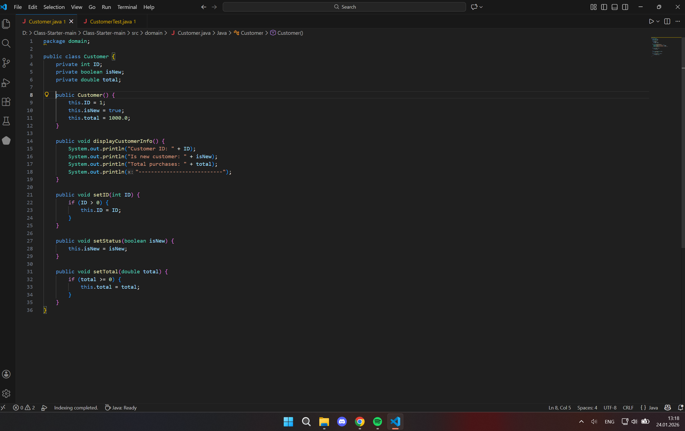
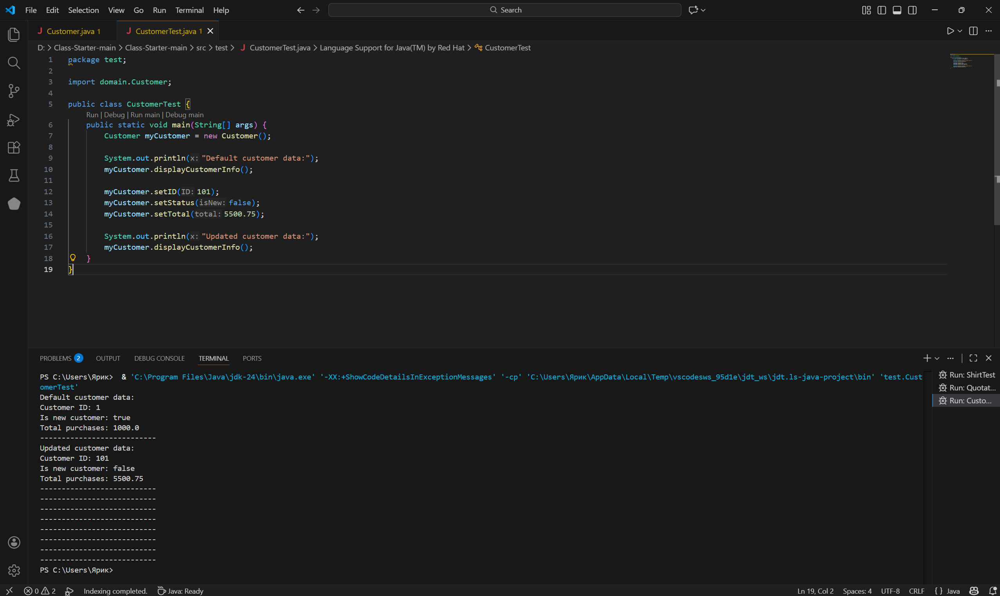

# Звіт до завдання №1

## Код програми
Нижче наведено скріншоти вихідного коду програми:

> **Примітка:** Переконайтеся, що на зображеннях чітко видно синтаксис та логіку програми.

## Результат виконання
(Тут можна додати скріншот терміналу або вікна з результатом)
 
